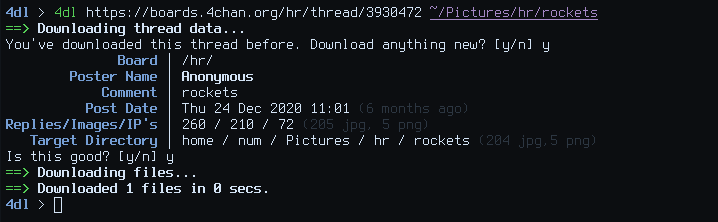

# 4dl

4dl is a 4chan image downloader written in bash. It uses the 4chan API to scrape threads for all the images then downloads them with wget. Over the years I've made many iterations of this and currently this is the best in my opinion. It could be better (more modular, have archive support, better command-line flags) but it's fast and it works. It is more or less feature complete for what I want it to do so I thought I'll just put it on GitHub.

I think it could be rewritten in POSIX shell in the future which is a goal of mine but it probably won't add anymore features. Speaking of features...

## Features

- Pretty print display of the thread stats - such as poster name, board, subject, comment, post date, replies, files etc - before downloading.
- Cache's the thread data so only one web request needs to be made, aside from downloading.
- Saves the thread no. and board to a file so you can tell if you've downloaded the thread before. Useful when downloading wallpapers from /wg/. Also uses the `--no-clobber` wget flag which will not redownload things that are already downloaded.
- Calculates, at the end, how many files were downloaded and how long it took in a human readable format.
- If the bump/image limit has been reached or the thread is archived then a status message will appear.
- Parallel downloading for faster downloads.

# Dependencies

- bash obviously
- coreutils
- curl
- dateutils
- jq
- wget
- xargs
